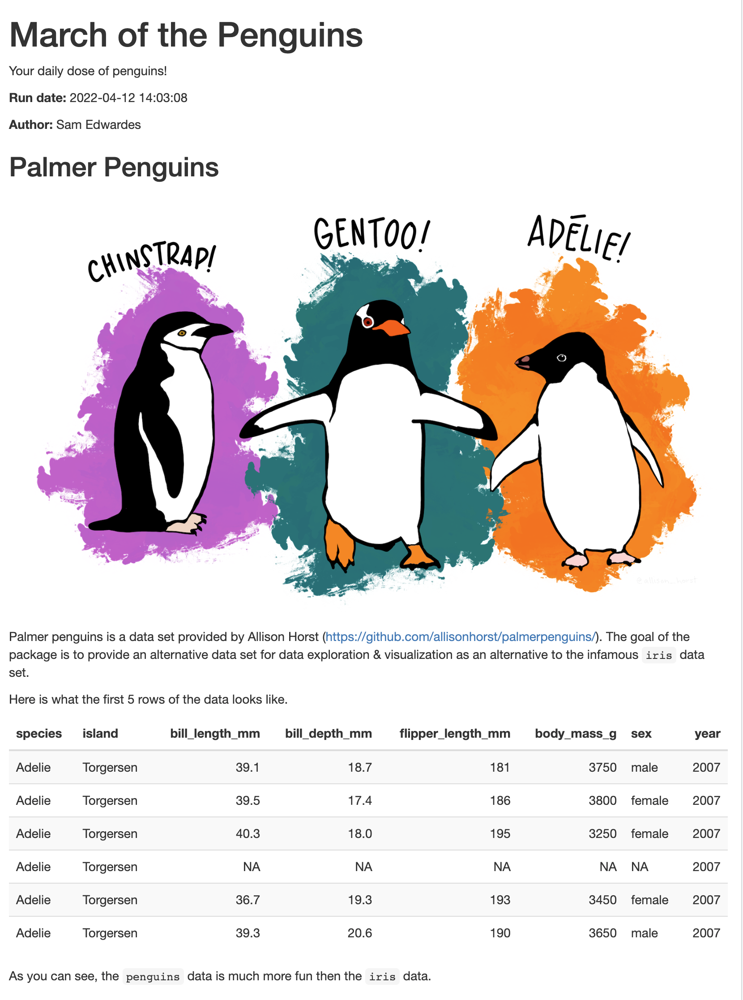

# demo-rmd-penguins

An parameterized RMarkdown report!

- Code: <https://github.com/SamEdwardes/demo-rmd-penguins>
- Deployment: <https://colorado.rstudio.com/rsc/demo-rmd-penguins/>



## Usage

To render the report run:

```r
knit_with_parameters("~/projects/demo-rmd-penguins/report.Rmd")
```

## Deployment

To deploy the report to RStudio Connect:

```r
rsconnect::writeManifest("report")
```

Then commit any changes to GitHub.
